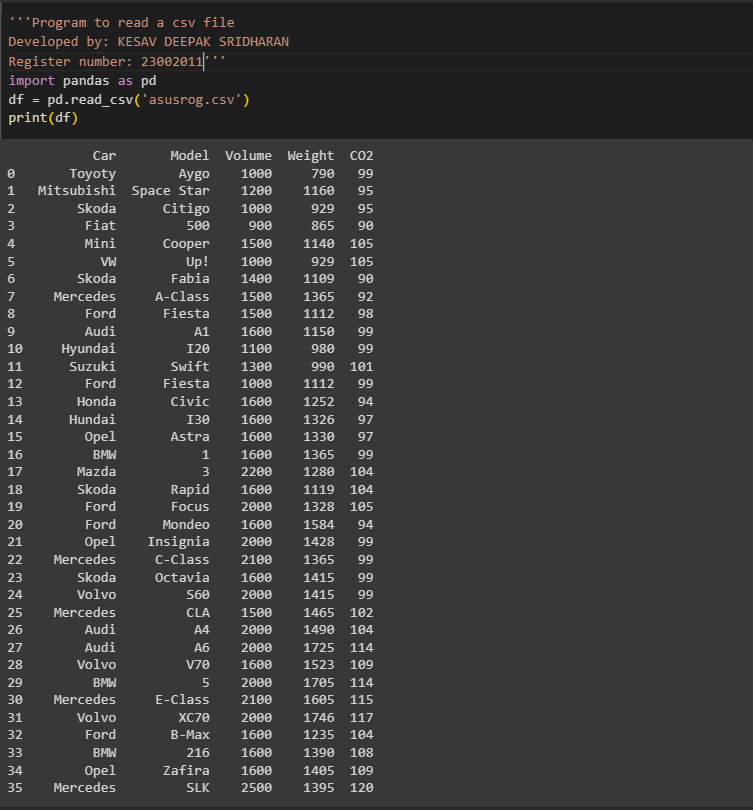

# Read-from-CSV

## AIM:
Program to read a CSV file
## ALGORITHM:
### Step 1:
Import the pandas library
### Step 2:
Provide the CSV file path
### Step 3:
Read the CSV file into a variable.
### Step 4:
Print the DataFrame.
### Step 5:
End the program.
## PROGRAM:
```python
'''Program to read a csv file 
Developed by: KESAV DEEPAK SRIDHARAN
Register number: 23002011'''
import pandas as pd
df = pd.read_csv('asusrog.csv')
print(df)
```
## OUTPUT:

## RESULT:
Thus the program to read a CSV file is written and verified using python programming.

